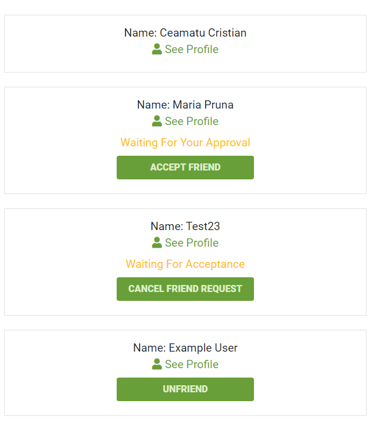
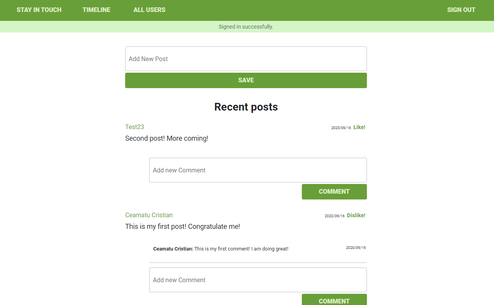

 

# Social web app built in rails with users, posts, comments, likes and friendship functionality

> In this project, we built by a social app where users can register/sign in/sign out, create posts and comments, can like other posts and request/accept friendships with other users. The project enforced our skills in using most core functionalities of the Rails framework.

## App functionality
* Users can sign up, sign out, recover forgotten passwords
* Users can create posts and comments
* Users can like posts
* Users can request or accept friendships and they also have the possibility to cancel a friendship

## This web app is live, you can check it here: [Live demo](https://microverse-rails-social-app.herokuapp.com/)

## Check the Entity Relathionship Diagram of the Database on [lucidchart.com](https://app.lucidchart.com/documents/edit/d5990996-0f54-4a99-b135-bc363b345728/0_0#?folder_id=home&browser=icon)

## Screenshots of the app.

## Built With
* Ruby
* Rails
* RSpec
* PostgreSQL

## Prerequisities

To get this project up and running locally, you must have ruby and postgres installed on your computer.

## Getting Started

**To get this project set up on your local machine, follow these simple steps:**

**Step 1** 
Navigate through the local folder where you want to clone the repository and run 
`https://github.com/uimarshall/ror-social-scaffold`. It will clone the repo to your local folder. 
or with https 
`https://github.com/uimarshall/ror-social-scaffold.git`. 
**Step 2** 
Run `cd ror-social-scaffold` 
**Step 3** 
Run `bundle install` to install the gems from the `Gemfile`. 
**Step 4** 
Run `yarn install` to install the npm packages from the `package.json` file. 
**Step 5** 
Run `bundle exec figaro install`, this will create a file called `application.yml` in the `config` folder. 
**Step 6** 
Open  `config/application.yml` and add your credenatials for your postgres account like  this: 
`ROR_SOCIAL_SCAFFOLD_DATABASE_PASSWORD: "examplePassword"`  
`ROR_SOCIAL_SCAFFOLD_DATABASE_USER: "exampleUser"` 
**Step 7** 
Run `rails db:create` and `rails db:migrate` to create and migrate the database tabels and associations. 
**Step 8** 
Run `rails s` to start the rails server. 
**Step 9** 
You can visit the app at `http://localhost:3000`. Enjoy! 

## Tests

1. Open Terminal

2. Migrate the test database:

    `rails db:migrate RAILS_ENV=test`

2. Run the tests with the command:

    `rspec`

## Authors

👤 **Marshall Akpan**

- Github: [uimarshall](https://github.com/uimarshall)
- Twitter: [uimarshall](https://twitter.com/uimarshall)
- Linkedin: [Marshall Akpan](https://www.linkedin.com/in/marshall-akpan-19745526/)

👤 **Cristian Viorel Ceamatu**

- Github: [@cristianCeamatu](https://github.com/cristianCeamatu)
- Twitter: [@CeamatuV](https://twitter.com/CeamatuV)
- Linkedin: [Ceamatu Cristian](https://www.linkedin.com/in/ceamatu-cristian/)

## 🤝 Contributing

Our favourite contributions are those that help us improve the project, whether with a contribution, an issue, or a feature request!

## Show your support

If you've read this far....give us a ⭐️!

## 📝 License

This project is licensed by Microverse and the Odin Project